
# COMP2150  - Level Design Document
### Name: Louis Purcell
### Student number: 47311088

## 1. Player Experience 

### 1.1. Discovery

Progressive Skill Development: Starting with basic controls in the initial levels, such as movement and combat, players gradually learn more advanced maneuvers like crouching and shooting simultaneously, jumping while dodging spikes, and navigating through complex environments. This approach ensures players can always handle the information simultaneously, allowing them to develop their skills organically.

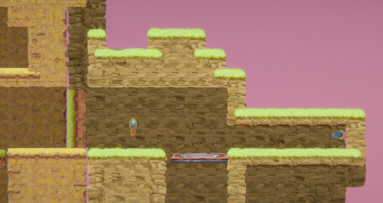

Enemy Awareness and Strategy:  Players must adapt their tactics and strategies from the initial encounter with elemental foes like acid and chomper to the introduction of more formidable adversaries like spitters. By learning the strengths and weaknesses of each enemy type, players can devise practical approaches to overcome obstacles and progress through the levels.

Decision-Making and Risk Assessment: The level design incorporates elements that require players to make decisions and take calculated risks. For example, in the final level, players are presented with three distinct paths, each with challenges and rewards. This encourages players to consider their options carefully, weighing the potential dangers against the possible benefits. 

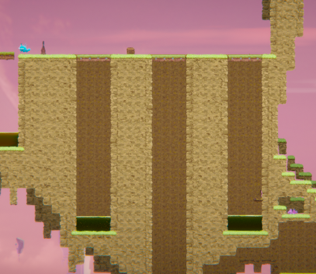

Anticipation and Adaptation: By introducing unexpected twists and obstacles, such as deceptive pathways and environmental hazards, players must learn to think on their feet and adjust their strategies in real-time. This keeps players on their toes and promotes a sense of satisfaction as they successfully navigate unpredictable situations.

### 1.2. Drama

Introduction of Mechanics and Incremental Complexity:  This gives a gentle introduction, allowing players to familiarise themselves with the game environment without feeling overwhelmed when the levels progress. For example, players encounter a new enemy type (spitters) in the second level and learn to utilise a long-range weapon. This increases the complexity of gameplay while still building upon the skills learned in previous levels.

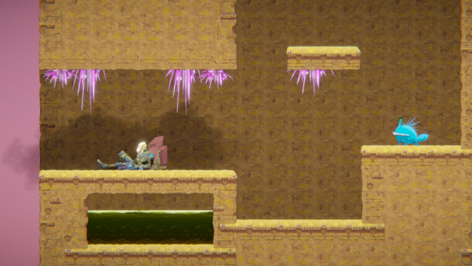

Problem-Solving: I integrated problem-solving elements into the gameplay, such as pressure plates that require strategic thinking to navigate. This adds depth to the gameplay experience and encourages players to think critically about their actions.

Moments of Tension and Relief: I strategically insert moments of tension and relief throughout the game to keep the player engaged. For instance, the player may face intense combat encounters followed by moments of exploration or puzzle-solving, providing a brief respite before the next challenge.

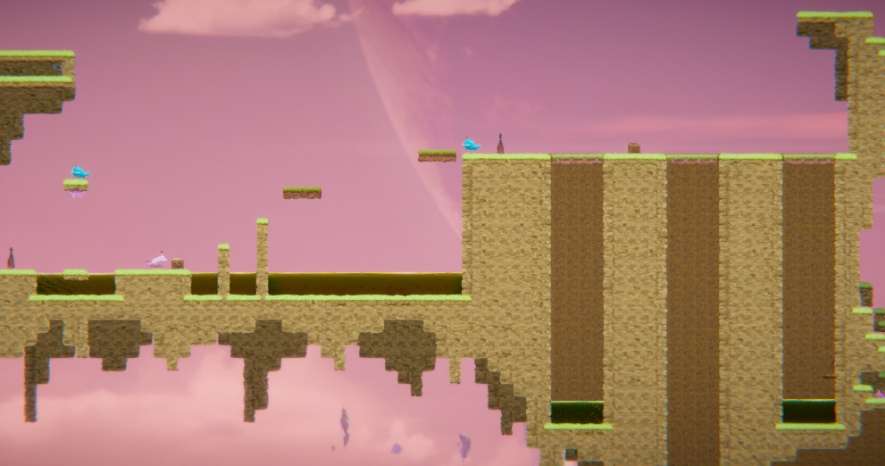

Navigational Complexity: In the final level, players must master all previously introduced mechanics and skills. I introduced branching paths and navigational challenges that require careful exploration and decision-making. Players must navigate through deceptive routes and backtrack to complete tasks, adding a layer of complexity and uncertainty to the gameplay.

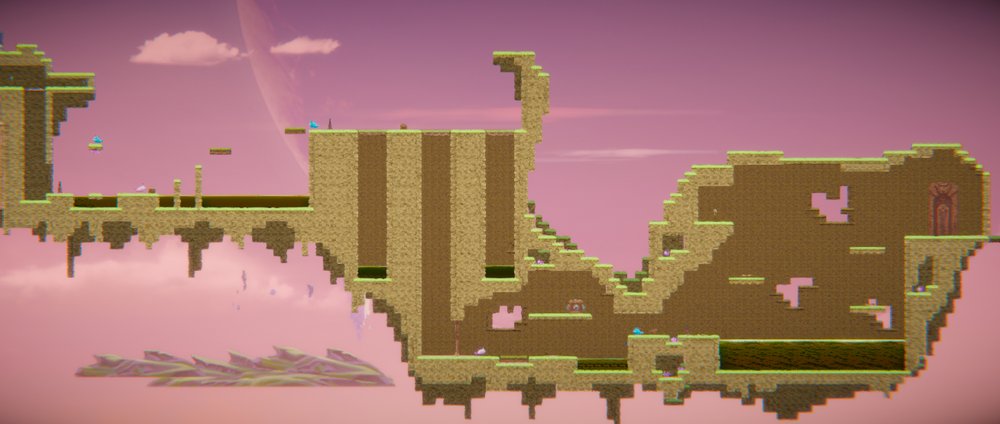

### 1.3. Challenge

Mechanical Mastery: Players must become proficient in executing mechanics to progress effectively from basic movements to more complex actions like combat maneuvers and environmental interactions. Each level builds upon the skills learned in previous levels, allowing players to acclimate to the controls at their own pace. 

Environmental Hazards and Obstacles Hazards include spikes, acid pools, and other traps requiring precise timing and navigation. I've carefully placed these obstacles in the game world to control the difficulty curve, ensuring they are challenging enough to provide a sense of accomplishment when overcome but not so punishing as to frustrate players. 

Puzzle-Solving and Exploration: To maintain engagement during these levels, I've designed intuitive and solvable puzzles with the information provided within the game world. 

### 1.4. Exploration

Organic and Immersive Environments: I strived to make the environments feel organic and immersive, seamlessly blending landscape elements with gameplay features. For example, spikes are integrated into the natural terrain, making them feel like a natural part of the environment rather than artificially placed obstacles. By incorporating these elements into the landscape, players are encouraged to explore their surroundings more deeply, as they feel like authentic parts of the game world.

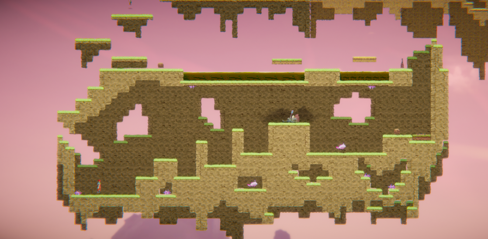

Curved and Natural Layouts: The level layouts are designed with curves and natural contours rather than rigid block-like structures. This adds visual interest and contributes to the believability and immersion of the game world. Players feel like they are navigating through caves in floating islands, enhancing the sense of discovery and exploration.

Distinct and Memorable Spaces: Through the aesthetic and layout choices, I aimed to create different and memorable spaces that leave a lasting impression on players. Each area of the game world has its unique visual identity and atmosphere, from pink voluminous cotton candy skies to ominous caverns, by carefully crafting these spaces with attention to detail, lighting, and environmental storytelling.

Negative Space as Background: I kept negative space uncluttered to draw attention to key objects and elements, guiding the player's movement and focus. 

Positive Space: These spaces are not merely background elements but integral components of the game world that contribute to its atmosphere and narrative.

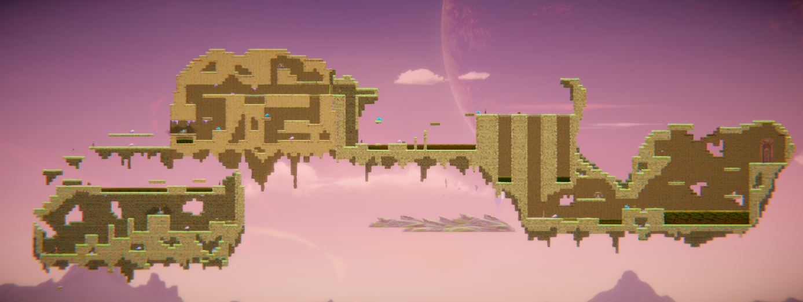

## 2. Core Gameplay 

### 2.1. Acid

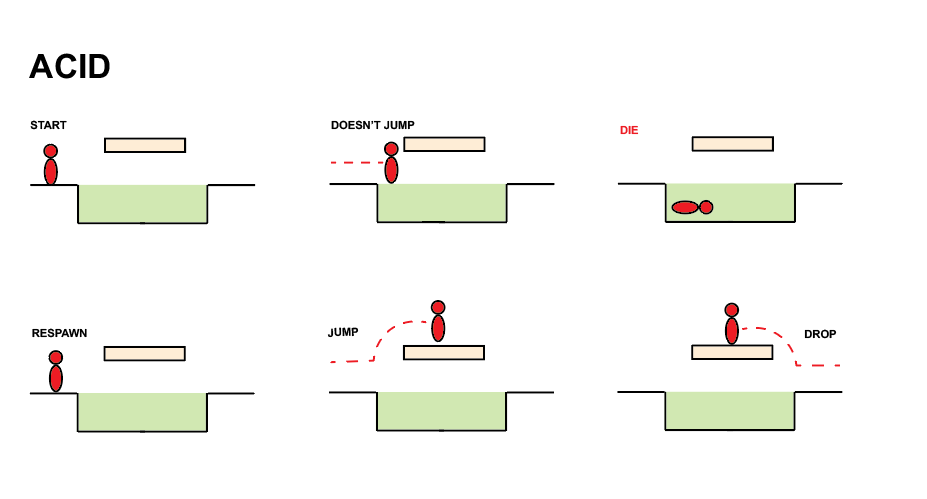

The player approaches a pool of acid.
As the player steps into the acid, they die and respawn at the most recent checkpoint.
The player then figures they need to find another way to get past
Introducing acid early in the game establishes it as a dangerous environmental hazard, teaching players to recognise and avoid it to prevent losing progression.

### 2.2. Checkpoints

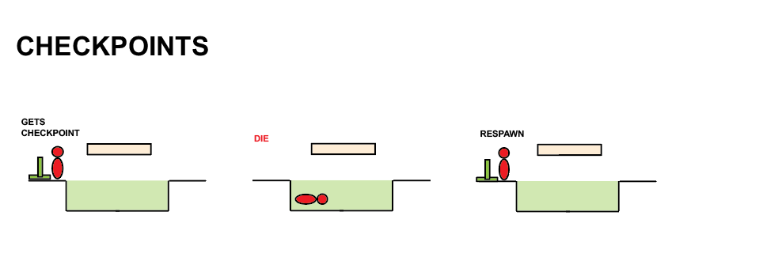

The player reaches a glowing checkpoint marker.
The player activates the checkpoint by interacting with it, causing it to emit a bright light.
The introduction of checkpoints ensures players understand they can save progress and respawn, providing security as they navigate challenging game sections.

### 2.3. Chompers

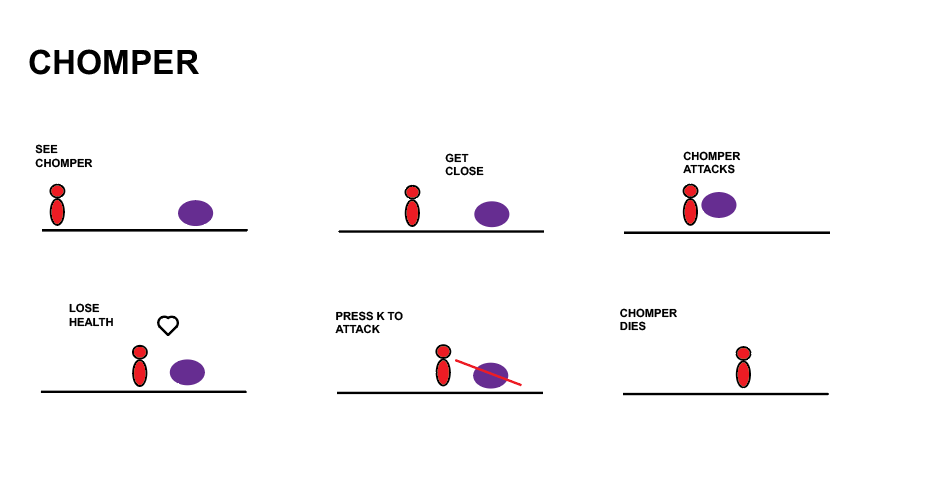

The player encounters an enemy after picking up a weapon.
As the player approaches, the chompers attack and will lose health if hit.
The player can use their weapon to defeat the chompers and continue.
Introducing chompers after introducing the weapon helps the player understand how to deal with the enemy.

### 2.4. Health Pickups

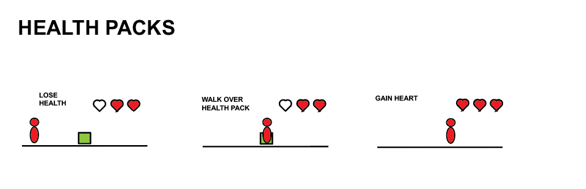

The player approaches a health pickup on the ground, with a medical cross symbol displayed within it.
As the player collects the health pickup, their health bar replenishes.
Health only goes up if the player has previously taken damage
Introducing health pickups after the first encounter with the enemy provides players with a means to recover from damage taken, teaching them the importance of managing their health throughout the game.

### 2.5. Keys

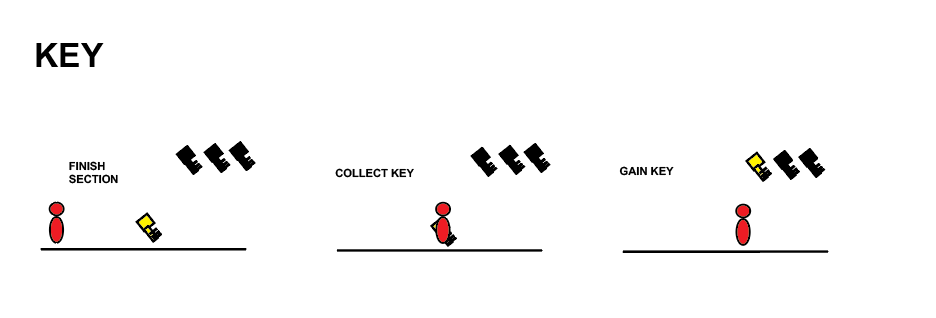

The player discovers the key symbol once completing a segment of the level.
Once collected, the Key will appear as on the top of the screen.
Collecting the Key shows the player the player has completed a part of the level and gives them a sense of completion.

### 2.6. Moving Platforms

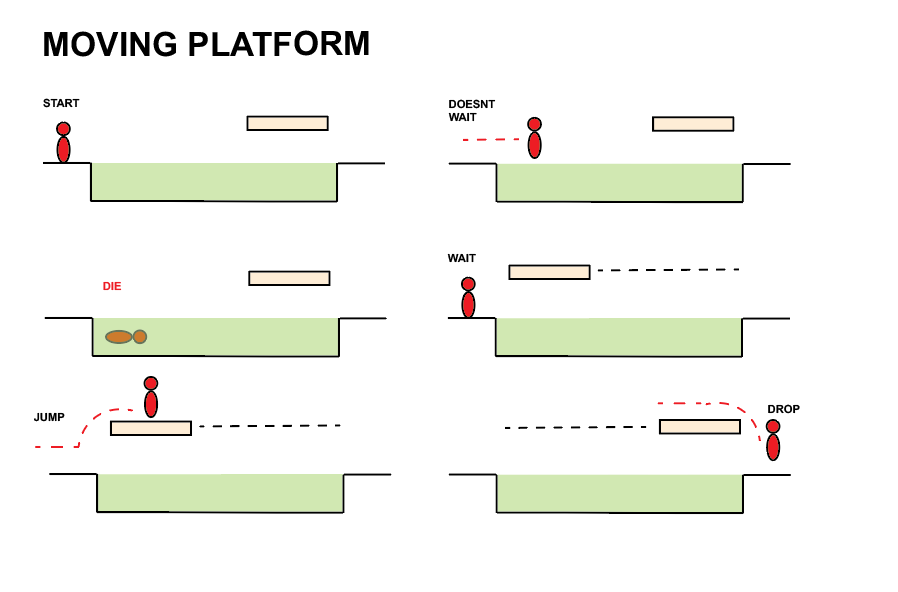

The player approaches a large pool of acid with a platform moving from one side to another.
As the player steps onto a moving platform, they are carried over the acid pool.
Moving platforms familiarise players with platforming mechanics and dynamic level elements, preparing them for more complex platforming challenges later in the game.

### 2.7. Passthrough Platforms

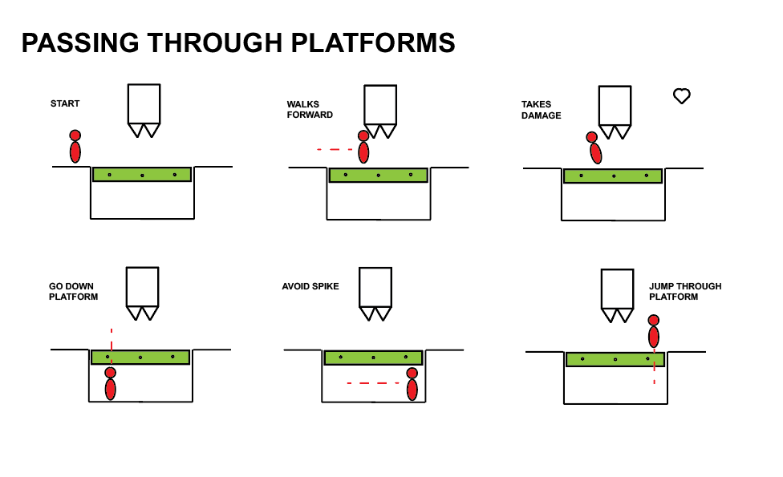

The player encounters a platform with circles on it and realises they are unable to get past the spikes.
Once the player is safe from the spikes, they can jump back up through the platform.
The passthrough platforms make players navigate hazardous areas safely, adding depth to platforming and traversal mechanics.

### 2.8. Spikes

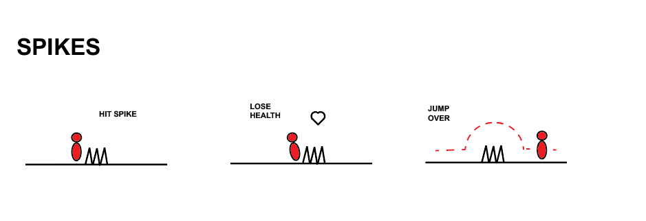

The player approaches a section of the ground with sharp spikes.
As the player steps onto the spikes, they take damage.
The player retreats from the spikes and finds an alternate path to get past them.
The initial introduction to the spikes emphasises their role as deadly hazards, teaching players to avoid them.

### 2.9. Spitters

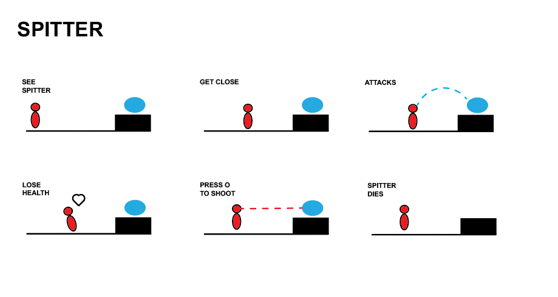

The player encounters a spitter enemy perched on a ledge.
The spitter launches projectiles at the player character, demonstrating its ranged attack.
The player can evade the projectiles and defeat the spitter using ranged or melee attacks.
Spitters introduce players to ranged combat mechanics and teach them to prioritise and strategise when dealing with different enemy types.

### 2.10. Weapon Pickup (Gun)

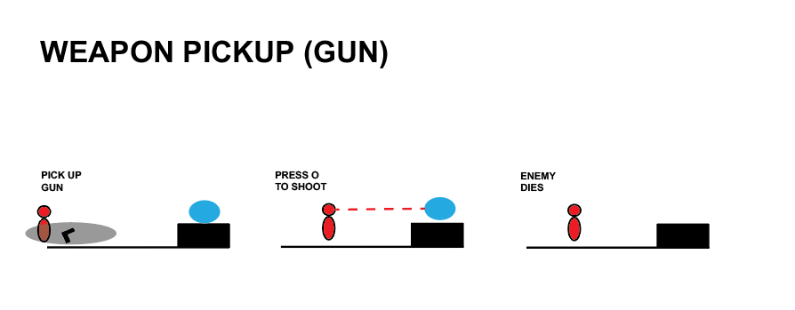

The player discovers a gun pickup on the ground.
The player then uses 'O' to use the gun and defeat the enemy ahead.
Introducing the gun simultaneously with the spitters helps the player understand how to deal with ranged situations.

### 2.11. Weapon Pickup (Staff)

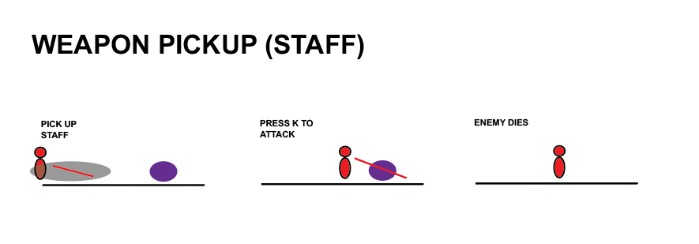

The player discovers a staff pickup on the ground.
The player then uses 'K' to use the staff and defeat the enemy ahead.
Introducing the staff with the chomper helps the player understand how to deal with the enemy.

## 3. Spatiotemporal Design
 
### 3.1. Molecule Diagram

### 3.2. Level Map – Section 1

### 3.3.	Level Map – Section 2

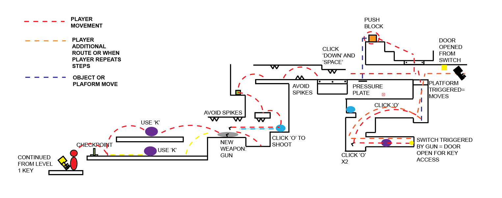

### 3.4.	Level Map – Section 3

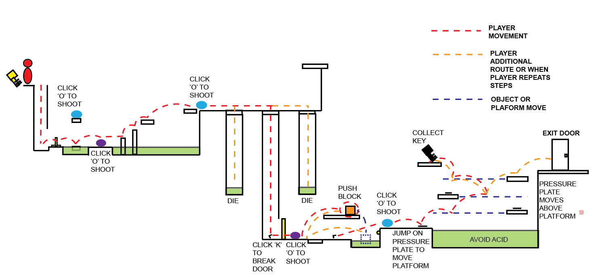

## 4. Iterative Design 
Initial Prototypes and Grey-Boxed Maps: I started with rough sketches using red to show the player's movement and routes and blue to show objects, platforms and enemy movement. These early prototypes helped me identify potential pacing, navigation, and gameplay mechanics issues. 

Feedback and Iteration: I gathered feedback from playtesters, analysing their experiences and identifying areas for improvement. For example, one of my playtesters didn't know where to continue at one point; this made me realise I had to create a positive space to guide them to continue along the path.

Unity Implementation: After finalising my level design maps, I implemented them in Unity. However, during this process, I encountered technical and gameplay limitations requiring further Iteration. For example, we may have needed to adjust the size or placement of certain assets to optimise performance or improve gameplay balance. 

Design Changes in Unity: I made several design changes to enhance the player experience based on playtesting and observation within the Unity environment. This includes tweaking the placement of obstacles to create more challenging encounters, adjusting lighting and ambience to improve the atmosphere, or refining the visual composition to create more distinct and memorable spaces. 

Example of Further Iterative Design: One aspect of my level design that could be improved through further Iteration is the pacing of encounters. While we've designed a variety of challenges and obstacles, the pacing of these encounters may sometimes align with the player's expectations or preferences. By iterating on the moving platform timing, environmental hazards, and interactive elements, I created a more balanced and engaging experience that maintains momentum without feeling overwhelming or repetitive. 

## Generative AI Use Acknowledgement

No Generative AI was used.

